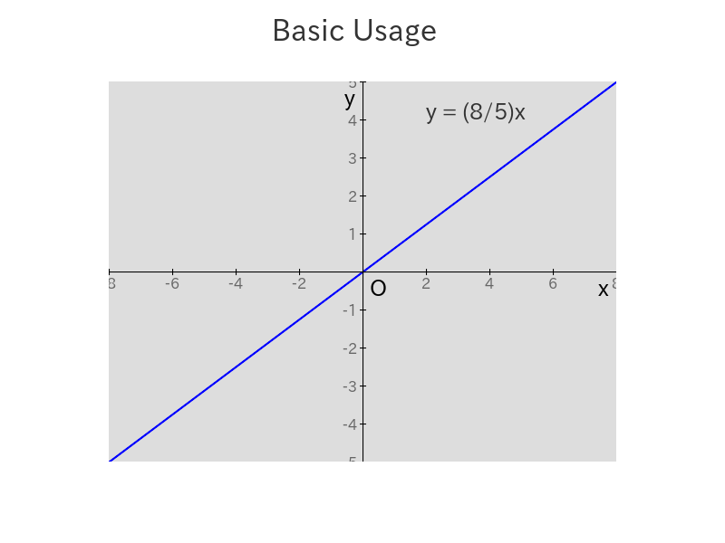
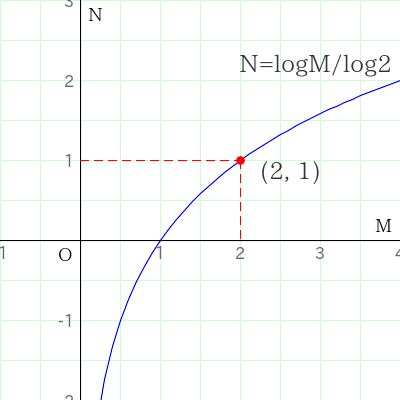

# PHP-Plotter2d

A PHP Library to plot graphs and figures on a xy(-two-dimensional)-plane.

## 1. Features

`PHP-Plotter2d` provides basic features to plot graphs and figures on a xy(-two-dimensional)-plane.

### 1.1. Canvas

You can draw figures freely on the canvas, such as:
`Pixels`, `Lines`, `Boxes`, `Circles`, `Ellipses`, `Polygons` and `Bezier Curves`.
You can also put `Text` or `Fill` the canvas with a specific color.
You can save the `Canvas` to a file.


### 1.2. Plotarea

You can put figures  within the `Plotarea` by just specifying the coordinates on the xy-plane without having to consider the pixel coordinates on the image.
`Transformer` automatically maps the coordinates on the xy-plane to pixel coordinates on the image.
`Plotarea` is automatically placed on the `Canvas`.
You can adjust the position and the size of `Plotarea` on the `Canvas`.


### 1.3. Transformer
You can use only `Transformer` separately from `Canvas` and `Plotarea`.

```php
use Macocci7\PhpPlotter2d\Transformer;

$transformer = new Transformer(
    viewport: ['x' => [-1, 4], 'y' => [-2, 3]],
    plotarea: [
        'width' => 400,
        'height' => 400,
    ],
);

$points = $transformer->getCoords([
    [-0.5, -1.2],
    [1.3, 0.6],
    [3.4, 2.8],
]);
```

## 2. Contents

- [1. Features](#1-features)
    - [1.1. Canvas](#11-canvas)
    - [1.2. Plotarea](#12-plotarea)
    - [1.3. Transformer](#13-transformer)
- 2\. Contents
- [3. Requirements](#3-requirements)
- [4. Installation](#4-installation)
- [5. Usage](#5-usage)
    - [5.1. Handling Canvas](#51-handling-canvas)
    - [5.2. Handling Plotarea](#52-handling-plotarea)
    - [5.3. Handling Transformer](#53-handling-transformer)
- [6. Examples](#6-examples)
- [7. LICENSE](#7-license)

## 3. Requirements

- PHP 8.1 or later
- Imagick PHP Extention
- Composer

## 4. Installation

```bash
composer require macocci7/php-plotter2d
```

## 5. Usage

### 5.1. Handling Canvas

To draw figures on the `Canvas`, create an instance of `Canvas` at first.
Use `Plotter::make()` method to get an instance of `Canvas`.
Pass the `width` and `height` of the `Canvas` in the `canvasSize` parameter.

```php
<?php

require_once __DIR__ . '/../vendor/autoload.php';

use Macocci7\PhpPlotter2d\Plotter;

$canvas = Plotter::make(
    canvasSize: ['width' => 800, 'height' => 400],  // required
);
```

Now, you can draw figures on the `Canvas` with `draw*` methods.

```php
$canvas->drawText('Basic Usage', 300, 20, 32, valign: 'top');
```

You can save the image into a file with `save` method.

```php
$canvas
    ->drawText('Handling Canvas', 300, 20, 32, valign: 'top')
    ->save('img/HandlingCanvas.png');
```

Available methods to draw on the `Canvas`:

- [fill()](#fill)
- [drawPixel()](#drawpixel)
- [drawLine()](#drawline)
- [drawBox()](#drawbox)
- [drawCircle()](#drawcircle)
- [drawEllipse()](#drawellipse)
- [drawArc()](#drawarc)
- [drawEllipticalArc()](#drawellipticalarc)
- [drawPolygon()](#drawpolygon)
- [drawBezier()](#drawbezier)
- [drawText()](#drawtext)

#### fill()

fills the `Canvas` with the specified color.

|params|type|required|default|exampl|description|
|:---|:---|:---|:---:|:---:|:---|
|$x|int|required||10|horizontal position (in pixel)|
|$y|int|required||20|vertical position (in pixel)|
|$color|string|required||'#0000ff'|color code (in hex format)|

#### drawPixel()

draws a pixel.

|params|type|required|default|exampl|description|
|:---|:---|:---|:---:|:---:|:---|
|$x|int|required||10|horizontal position (in pixel)|
|$y|int|required||20|vertical position (in pixel)|
|$color|string|required||'#0000ff'|color code (in hex format)|

#### drawLine()

draws a line.

|params|type|required|default|exampl|description|
|:---|:---|:---|:---:|:---:|:---|
|$x1|int|required||10|horizontal position of starting point (in pixel)|
|$y1|int|required||20|vertical position of starting point (in pixel)|
|$x2|int|required||30|horizontal position of end point (in pixel)|
|$y2|int|required||40|vertical position of end point (in pixel)|
|$width|int||1|2|vertical position (in pixel)|
|$color|string||'#000000'|'#0000ff'|color code (in hex format)|
|$dash|int[]||[]|[8, 4, 2, 4]|dash pattern(solid and blank)|

#### drawBox()

draws a box.

> Note: `null` value for a color code results in transparent.

|params|type|required|default|exampl|description|
|:---|:---|:---|:---:|:---:|:---|
|$x1|int|required||10|horizontal position of starting point (in pixel)|
|$y1|int|required||20|vertical position of starting point (in pixel)|
|$x2|int|required||30|horizontal position of end point (in pixel)|
|$y2|int|required||40|vertical position of end point (in pixel)|
|$backgroundColor|string\|null||`null`|'#ccffff'|background color (in hex format)|
|$borderWidth|int||1|2|border width (in pixel)|
|$borderColor|string\|null||'#000000'|'#0000ff'|border color (in hex format)|
|$dash|int[]||[]|[8, 4, 2, 4]|dash pattern (solid and blank)|

#### drawCircle()

draws a circle.

> Note: `null` value for a color code results in transparent.

|params|type|required|default|exampl|description|
|:---|:---|:---|:---:|:---:|:---|
|$x|int|required||60|horizontal position of the center (in pixel)|
|$y|int|required||50|vertical position of the center (in pixel)|
|$radius|int|required||40|radius of the circle (in pixel)|
|$backgroundColor|string\|null||`null`|'#ccffff'|background color (in hex format)|
|$borderWidth|int||1|2|border width (in pixel)|
|$borderColor|string\|null||'#000000'|'#0000ff'|border color (in hex format)|

#### drawEllipse()

draws an ellipse.

> Note: `null` value for a color code results in transparent.

|params|type|required|default|exampl|description|
|:---|:---|:---|:---:|:---:|:---|
|$x|int|required||60|horizontal position of the center (in pixel)|
|$y|int|required||50|vertical position of the center (in pixel)|
|$width|int|required||40|width of the ellipse (in pixel)|
|$height|int|required||30|height of the ellipse (in pixel)|
|$backgroundColor|string\|null||`null`|'#ccffff'|background color (in hex format)|
|$borderWidth|int||1|2|border width (in pixel)|
|$borderColor|string\|null||'#000000'|'#0000ff'|border color (in hex format)|

#### drawArc()

draws an arc.

> Note: `null` value for a color code results in transparent.

|params|type|required|default|exampl|description|
|:---|:---|:---|:---:|:---:|:---|
|$x|int|required||60|horizontal position of the center (in pixel)|
|$y|int|required||50|vertical position of the center (in pixel)|
|$radius|int|required||40|radius of the circle (in pixel)|
|$degrees1|int\|float|required||32.1|starting angle (in degrees)|
|$degrees2|int\|float|required||-23.4|terminal angle (in degrees)|
|$backgroundColor|string\|null||`null`|'#ccffff'|background color (in hex format)|
|$borderWidth|int||1|2|border width (in pixel)|
|$borderColor|string\|null||'#000000'|'#0000ff'|border color (in hex format)|
|$withSides|bool||`false`|`true`|whether to draw sides|

#### drawEllipticalArc()

draws an elliptical arc.

> Note: If a non-null background color is specified, or `true` is specified for the `withSide` argument, an elliptical sector connecting the center of the ellipse and the elliptical arc will be drawn.

> Note: `null` value for a color code results in transparent.

|params|type|required|default|exampl|description|
|:---|:---|:---|:---:|:---:|:---|
|$x|int|required||60|horizontal position of the center (in pixel)|
|$y|int|required||50|vertical position of the center (in pixel)|
|$width|int|required||80|width of the ellipse (in pixel)|
|$height|int|required||120|height of the ellipse (in pixel)|
|$degrees1|int\|float|required||32.1|starting angle (in degrees)|
|$degrees2|int\|float|required||-23.4|terminal angle (in degrees)|
|$backgroundColor|string\|null||`null`|'#ccffff'|background color (in hex format)|
|$borderWidth|int||1|2|border width (in pixel)|
|$borderColor|string\|null||'#000000'|'#0000ff'|border color (in hex format)|
|$withSides|bool||`false`|`true`|whether to draw sides|

#### drawPolygon()

draws a polygon.

> Note: `null` value for a color code results in transparent.

|params|type|required|default|exampl|description|
|:---|:---|:---|:---:|:---:|:---|
|$points|array<int, int[]>|required||[[1, 2], [3, 4]]|positions of the points (in pixel)|
|$backgroundColor|string\|null||`null`|'#ccffff'|background color (in hex format)|
|$borderWidth|int||1|2|border width (in pixel)|
|$borderColor|string\|null||'#000000'|'#0000ff'|border color (in hex format)|

#### drawBezier()

draws a Bezier curve.

> Note: `null` value for a color code results in transparent.

|params|type|required|default|exampl|description|
|:---|:---|:---|:---:|:---:|:---|
|$points|array<int, int[]>|required||[[1, 2], [3, 4]]|positions of the points (in pixel)|
|$backgroundColor|string\|null||`null`|'#ccffff'|background color (in hex format)|
|$borderWidth|int||1|2|border width (in pixel)|
|$borderColor|string\|null||'#000000'|'#0000ff'|border color (in hex format)|

#### drawText()

draws text.

|params|type|required|default|exampl|description|
|:---|:---|:---|:---:|:---:|:---|
|$text|string|required||'Title'|text to draw|
|$x|int|required||40|horizontal position (in pixel)|
|$y|int|required||40|vertical position (in pixel)|
|$fontSize|int||16|32|font size (in pixel)|
|$fontPath|string||'./fonts/myfont.ttf'|32|font path (true type)|
|$fontColor|string||'#000000|'#009900'|font color (in hex format)|
|$align|string||'left'|'center'|border width (in pixel)|
|$valign|string||'bottom'|'middle'|border color (in hex format)|
|$angle|int\float||0|-23.4|degrees to rotate (counterclockwise)|
|$offsetX|int\float||0|3.5|x-offset from left edge (after rotation)|
|$offsetY|int\float||0|-1.5|y-offset from top edge (after rotation)|

### 5.2. Handling Plotarea

To plot figures within the `Plotarea`, ceate an instance of `Canvas` with the parameters of `viewport` and `plotarea`.

`viewport` is the definition of the visible area of the xy-plane, which consists of arrays of x and y ranges.

`plotarea` has three attributes: `offset`, `width` and `height`.

```php
<?php

require_once __DIR__ . '/../vendor/autoload.php';

use Macocci7\PhpPlotter2d\Plotter;

$plotter = Plotter::make(
    canvasSize: [
        'width' => 800,     // required
        'height' => 400,    // required
    ],
    viewport: [
        'x' => [-5, 5],     // -5 <= x <= 5
        'y' => [-5, 5],     // -5 <= y <= 5
    ],
    plotarea: [
        // 20pix from left edge, 30pix from top edge
        // default=(10% of the canvas)
        'offset' => [20, 30],
        'width' => 640, // in pix, default=(80% of the canvas)
        'height' => 360 // in pix, default=(80% of the canvas)
    ],
    backgroundColor: '#0000cc',  // optional, default='#ffffff'
);
```

Now, you can plot figures within the `Plotarea` by using `plot*` methods with coordinates on the xy-plane.

```php
// boxrange: (-3.5, 4.2) - (2.5, 2.3)
// backgroundColor: '#ffff99'
// borderWidth: 1 (pix)
// borderColor: '#0000ff'
$canvas
    ->plotBox(-3.5, 4.2, 2.5, 2.3, '#ffff99', 1, '#0000ff')
    ->save('img/HandlingPlotarea.png');
```

Available `plot*` methods to plot figures within the `Plotarea`:

- [plotFill()](#plotfill)
- [plotPixel()](#plotpixel)
- [plotLine()](#plotline)
- [plotBox()](#plotbox)
- [plotCircle()](#plotcircle)
- [plotPerfectCircle()](#plotperfectcircle)
- [plotEllipse()](#plotellipse)
- [plotArc()](#plotarc)
- [plotPolygon()](#plotpolygon)
- [plotBezier()](#plotbezier)
- [plotText()](#plottext)
- [plotGridHorizon()](#plotgridhorizon)
- [plotGridVertical()](#plotgridvertical)
- [plotGridValuesX()](#plotgridvaluesx)
- [plotGridValuesY()](#plotgridvaluesy)
- [plotAxisX()](#plotaxisx)
- [plotAxisY()](#plotaxisy)
- [plotAxisLabelO()](#plotaxislabelo)
- [plotAxisLabelX()](#plotaxislabelx)
- [plotAxisLabelY()](#plotaxislabely)
- [plotScaleX()](#plotscalex)
- [plotScaleY()](#plotscaley)

#### plotFill()

fills the `Plotarea` with the specified color.

|parmas|type|required|default|example|description|
|:---|:---|:---|:---|:---:|:---|
|$x|int\|float|required||-2.4|x-coordinate|
|$y|int\|float|required||3.2|y-coordinate|
|$color|string|required||'#cccccc'|color code (in hex format)|

#### plotPixel()

plots a pixel within the `Plotarea`.

|parmas|type|required|default|example|description|
|:---|:---|:---|:---|:---:|:---|
|$x|int\|float|required||-3.5|x-coordinate|
|$y|int\|float|required||4.5|y-coordinate|
|$color|string|required||'#ff0000'|color code (in hex format)|

#### plotLine()

plots a line within the `Plotarea`.

|parmas|type|required|default|example|description|
|:---|:---|:---|:---|:---:|:---|
|$x1|int\|float|required||-6.2|x-coordinate of the starting point|
|$y1|int\|float|required||-7.4|y-coordinate of the starting point|
|$x2|int\|float|required||8.3|x-coordinate of the end point|
|$y2|int\|float|required||6.4|y-coordinate of the end point|
|$width|int||1|2|width (in pixel)|
|$color|string||'#000000'|'#009900'|color code (in hex format)|
|$dash|int[]||[]|[8, 4, 2, 4]|dash pattern (solid and blank)|

#### plotBox()

polots a box within the `Plotarea`.

> Note: `null` value for a color code results in transparent.

|parmas|type|required|default|example|description|
|:---|:---|:---|:---|:---:|:---|
|$x1|int\|float|required||-3.5|x-coordinate of the starting point|
|$y1|int\|float|required||4.5|y-coordinate of the starting point|
|$x2|int\|float|required||-0.5|x-coordinate of the end point|
|$y2|int\|float|required||2.5|y-coordinate of the end point|
|$backgroundColor|string\|null||`null`|'#cccccc'|background color (in hex format)|
|$borderWidth|int||1|2|border width (in pixel)|
|$borderColor|string\|null||'#000000'|'#0000ff'|border color (in hex format)|
|$dash|int[]||[]|[8, 4, 2, 4]|dash pattern (solid and blank)|

#### plotCircle()

plots a ciele within the `Plotarea`.

> Note: If the `viewport aspect ratio` and the `plotarea aspect ratio` are not equal, `plotCircle()` draws an ellipse.
>
> Use [plotPerfectCircle()](#plotperfectcircle) if you want to plot a perfect circle regardless of transformation rate.

> Note: `null` value for a color code results in transparent.

|parmas|type|required|default|example|description|
|:---|:---|:---|:---|:---:|:---|
|$x|int\|float|required||-3.5|x-coordinate of the center|
|$y|int\|float|required||4.5|y-coordinate of the center|
|$radius|int\|float|required||2.5|radius|
|$backgroundColor|string\|null||`null`|'#cccccc'|background color (in hex format)|
|$borderWidth|int||1|2|border width (in pixel)|
|$borderColor|string\|null||'#000000'|'#0000ff'|border color (in hex format)|

#### plotPerfectCircle()

plots a perfect ciele within the `Plotarea` regardless of transformation rate.

> Note: Specify the radius in pix.

> Note: `null` value for a color code results in transparent.

|parmas|type|required|default|example|description|
|:---|:---|:---|:---|:---:|:---|
|$x|int\|float|required||-3.5|x-coordinate of the center|
|$y|int\|float|required||4.5|y-coordinate of the center|
|$radius|int|required||2|radius (in pix)|
|$backgroundColor|string\|null||`null`|'#cccccc'|background color (in hex format)|
|$borderWidth|int||1|2|border width (in pixel)|
|$borderColor|string\|null||'#000000'|'#0000ff'|border color (in hex format)|

#### plotEllipse()

plots an ellipse within the `Plotarea`.

> Note: `null` value for a color code results in transparent.

|parmas|type|required|default|example|description|
|:---|:---|:---|:---|:---:|:---|
|$x|int\|float|required||-3.5|x-coordinate of the center|
|$y|int\|float|required||4.5|y-coordinate of the center|
|$width|int\|float|required||2.5|width|
|$height|int\|float|required||5.5|height|
|$backgroundColor|string\|null||`null`|'#cccccc'|background color (in hex format)|
|$borderWidth|int||1|2|border width (in pixel)|
|$borderColor|string\|null||'#000000'|'#0000ff'|border color (in hex format)|

#### plotArc()

plots an arc within the `Plotarea`.

> Note: If the `viewport aspect ratio` and the `plotarea aspect ratio` are not equal, `plotArc()` draws an elliptical arc.

> Note: `null` value for a color code results in transparent.

|parmas|type|required|default|example|description|
|:---|:---|:---|:---|:---:|:---|
|$x|int\|float|required||-3.5|x-coordinate of the center|
|$y|int\|float|required||4.5|y-coordinate of the center|
|$radius|int\|float|required||2.5|radius|
|$degrees1|int\|float|required||23.4|starting angle (in degrees)|
|$degrees2|int\|float|required||-32.1|terminal angle (in degrees)|
|$backgroundColor|string\|null||`null`|'#cccccc'|background color (in hex format)|
|$borderWidth|int||1|2|border width (in pixel)|
|$borderColor|string\|null||'#000000'|'#0000ff'|border color (in hex format)|
|$widthSides|bool||`false`|`true`|whether to draw sides|

#### plotPolygon()

plots a polygon within the `Plotarea`.

> Note: `null` value for a color code results in transparent.

|parmas|type|required|default|example|description|
|:---|:---|:---|:---|:---:|:---|
|$points|list<int[]>|required||[[-3, -4], [-2, 1]]|coorinates of the points|
|$backgroundColor|string\|null||`null`|'#cccccc'|background color (in hex format)|
|$borderWidth|int||1|2|border width (in pixel)|
|$borderColor|string\|null||'#000000'|'#0000ff'|border color (in hex format)|

#### plotBezier()

plots a Bezier curve within the `Plotarea`.

> Note: `null` value for a color code results in transparent.

|parmas|type|required|default|example|description|
|:---|:---|:---|:---|:---:|:---|
|$points|list<int[]>|required||[[-3, -4], [-2, 1]]|coorinates of the points|
|$backgroundColor|string\|null||`null`|'#cccccc'|background color (in hex format)|
|$borderWidth|int||1|2|border width (in pixel)|
|$borderColor|string\|null||'#000000'|'#0000ff'|border color (in hex format)|

#### plotText()

plots text within the `Plotarea`.

|parmas|type|required|default|example|description|
|:---|:---|:---|:---|:---:|:---|
|$text|string|required||'Title'|text to plot|
|$x|int\|string|required||-4.5|x-coordinate|
|$y|int\|string|required||4.5|y-coordinate|
|$fontSize|int||16|32|font size (in pix)|
|$fontPath|string||''|'./fonts/myfont.ttf'|font path (true type)|
|$fontColor|string||'#000000'|'#666666'|font color (in hex format)|
|$align|string||'left'|'center'|hirizontal align|
|$valign|string||'bottom'|'middle'|vertical align|
|$angle|int\|float||0|-23.4|degrees to rotate (counterclockwise)|
|$offsetX|int\|float||0|3.5|x-offset from left edge (after rotation)|
|$offsetY|int\|float||0|-1.5|y-offset from top edge (after rotation)|

#### plotGridHorizon()

plots horizontal grids within the `Plotarea`.

> Note: If `0` is passed to `$interval`, `$interval` will be set to the automatically calculated optimal value.

|parmas|type|required|default|example|description|
|:---|:---|:---|:---|:---:|:---|
|$interval|int\|float||0|2.5|interval between grids (in y direction)|
|$width|int||1|2|width (in pixel)|
|$color|string||'#999999'|'#ff99ff'|color code (in hex format)|

#### plotGridVertical()

plots vertical grids within the `Plotarea`.

> Note: If `0` is passed to `$interval`, `$interval` will be set to the automatically calculated optimal value.

|parmas|type|required|default|example|description|
|:---|:---|:---|:---|:---:|:---|
|$interval|int\|float||0|2.5|interval between grids (in x direction)|
|$width|int||1|2|width (in pixel)|
|$color|string||'#999999'|'#ff99ff'|color code (in hex format)|

#### plotGridValuesX()

plots grid values on the x-axis within the `Plotarea`.

> Note: If `0` is passed to `$interval`, `$interval` will be set to the automatically calculated optimal value.

|parmas|type|required|default|example|description|
|:---|:---|:---|:---|:---:|:---|
|$interval|int\|float||0|2.5|interval between grids (in x direction)|
|$size|int||16|2|width (in pixel)|
|$color|string||'#666666'|'#3333cc'|color code (in hex format)|
|$fontPath|string||''|'./fonts/myfont.ttf'|font path (true type)|
|$position|string||'lower'|'upper'|relative position to the x-axis|
|$except|int[]||[0]|[-5, -3, -1, 0, 1, 3, 5]|list of values to exclude|

#### plotGridValuesY()

plots grid values on the y-axis within the `Plotarea`.

> Note: If `0` is passed to `$interval`, `$interval` will be set to the automatically calculated optimal value.

|parmas|type|required|default|example|description|
|:---|:---|:---|:---|:---:|:---|
|$interval|int\|float||0|2.5|interval between grids (in y direction)|
|$size|int||16|2|width (in pixel)|
|$color|string||'#666666'|'#3333cc'|color code (in hex format)|
|$fontPath|string||''|'./fonts/myfont.ttf'|font path (true type)|
|$position|string||'lower'|'upper'|relative position to the x-axis|
|$except|int[]||[0]|[-5, -3, -1, 0, 1, 3, 5]|list of values to exclude|

#### plotAxisX()

plots x-axis with within the `Plotarea`.

|parmas|type|required|default|example|description|
|:---|:---|:---|:---|:---:|:---|
|$width|int||1|2|width (in pix)|
|$color|string||'#000000'|'#000099'|color code (in hex format)|

#### plotAxisY()

plots x-axis with within the `Plotarea`.

|parmas|type|required|default|example|description|
|:---|:---|:---|:---|:---:|:---|
|$width|int||1|2|width (in pix)|
|$color|string||'#000000'|'#000099'|color code (in hex format)|

#### plotAxisLabelO()

plots the origin label within the `Plotarea`.

|parmas|type|required|default|example|description|
|:---|:---|:---|:---|:---:|:---|
|$label|string||'O'|'Z'|width (in pix)|
|$size|int||16|24|font size (in pix)|
|$color|string||'#000000'|'#000099'|color code (in hex format)|
|$quadrant|int||3|4|number of quadrant to plot the label for|
|$fontPath|string||''|'./fonts/myfont.ttf'|font path (true type)|

#### plotAxisLabelX()

plots the x-axis label within the `Plotarea`.

|parmas|type|required|default|example|description|
|:---|:---|:---|:---|:---:|:---|
|$label|string||'x'|'A'|width (in pix)|
|$size|int||16|24|font size (in pix)|
|$color|string||'#000000'|'#000099'|color code (in hex format)|
|$position|string||'lower'|'upper'|relative position to the x-axis|
|$fontPath|string||''|'./fonts/myfont.ttf'|font path (true type)|

#### plotAxisLabelY()

plots the y-axis label within the `Plotarea`.

|parmas|type|required|default|example|description|
|:---|:---|:---|:---|:---:|:---|
|$label|string||'y'|'B'|width (in pix)|
|$size|int||16|24|font size (in pix)|
|$color|string||'#000000'|'#000099'|color code (in hex format)|
|$position|string||'left'|'right'|relative position to the y-axis|
|$fontPath|string||''|'./fonts/myfont.ttf'|font path (true type)|

#### plotScaleX()

plots the x-axis scale within the `Plotarea`.

> Note: If `0` is passed to `$interval`, `$interval` will be set to the automatically calculated optimal value.

|parmas|type|required|default|example|description|
|:---|:---|:---|:---|:---:|:---|
|$interval|int\|float||0|2.0|interval between scale lines.|
|$width|int||1|2|width (in pix)|
|$length|int||6|10|scale line length (in pix)|
|$color|string||'#000000'|'#990000'|color code (in hex format)|

#### plotScaleY()

plots the y-axis scale within the `Plotarea`.

> Note: If `0` is passed to `$interval`, `$interval` will be set to the automatically calculated optimal value.

|parmas|type|required|default|example|description|
|:---|:---|:---|:---|:---:|:---|
|$interval|int\|float||0|2.0|interval between scale lines.|
|$width|int||1|2|width (in pix)|
|$length|int||6|10|scale line length (in pix)|
|$color|string||'#000000'|'#990000'|color code (in hex format)|

### 5.3. Handling Transformer

To use `Transformer`, create an instance of `Transformer` at first.

```php
use Macocci7\PhpPlotter2d\Transformer;

$transformer = new Transformer(
    viewport: ['x' => [-1, 4], 'y' => [-2, 3]],
    plotarea: [
        'width' => 400,
        'height' => 400,
    ],
);
```

Now, you can use `get*` methods.

```php
$x = -0.5;
$y = 2.8;
$coord = $transformer->getCoord($x, $y);
echo "({$x}, {$y}) -> ({$coord['x']}, {$coord['y']})" . PHP_EOL;
```

This code results in:

```bash
(-0.5, 2.8) -> (40, 16)
```

Available methods:

- [getRateX()](#getratex)
- [getRateY()](#getratey)
- [getCoord()](#getcoord)
- [getCoords()](#getcoords)
- [getSpanX()](#getspanx)
- [getSpanY()](#getspany)

#### getRateX()

returns the transformation rate of x,

which is defined as:

```
(width of plogarea) / (range of x)
```

#### getRateY()

returns the transformation rate of y,

which is defined as:

```
(height of plotarea) / (range of y)
```

#### getCoord()

returns the transformed coordinate.

|params|type|required|default|example|description|
|:---|:---|:---|:---:|:---|:---|
|$x|int\|float|required||-0.5|x-coordinate on the xy-plane.|
|$y|int\|float|required||2.8|y-coordinate on the xy-plane.|

For example,

```php
$transformer->getCoord(-0.5, 2.8);
```

returns

```php
['x' => 40, 'y' => 16]
```

#### getCoords()

returns multiple transformed coordinates as an arrray.

|params|type|required|default|example|description|
|:---|:---|:---|:---:|:---|:---|
|$points|array<int, array<int, int\|float>>|required||(see below)|coordinates|

For example,

```php
$transformer->getCoords([
    [-0.5, -1.2],
    [1.3, 0.6],
    [3.4, 2.8],
]);
```

returns

```php
[
    0 => [40, 336],
    1 => [184, 192],
    2 => [352, 16],
]
```

#### getSpanX()

returns the transformed span of the x-direction component.

|params|type|required|default|example|description|
|:---|:---|:---|:---:|:---|:---|
|$span|int\|float|required||0.25|span of the x-direction component|

#### getSpanY()

returns the transformed span of the y-direction component.

|params|type|required|default|example|description|
|:---|:---|:---|:---:|:---|:---|
|$span|int\|float|required||0.25|span of the y-direction component|

## 6. Examples

- [BasicUsage.php](examples/BasicUsage.php) >> results in:

    

- [DrawOnCanvas.php](examples/DrawOnCanvas.php) >> results in:

    

- [PlotWithinPlotarea.php](examples/PlotWithinPlotarea.php) >> results in:

    

- [Graffiti.php](examples/Graffiti.php) >> results in:

    

- [GraphLogCurve.php](examples/GraphLogCurve.php) >> results in:

    

- [UseTransformer.php](examples/UseTransformer.php) >> results in:

    ```bash
    (-0.5, 2.8) -> (40, 16)
    ```

## 7. LICENSE

[MIT](LICENSE)

***

*Copyright 2024 macocci7*
